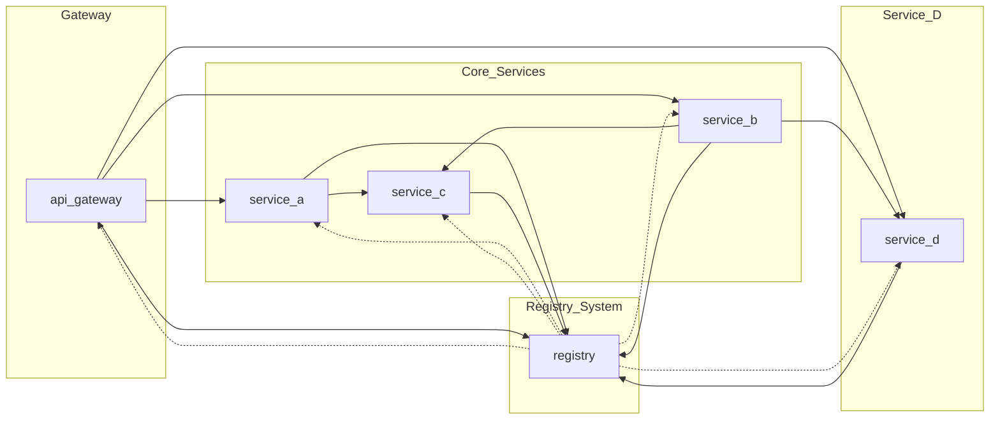

# LP-5.A

## Overview

In this lesson practice, you will take on the role of a backend developer joining a live distributed system. The architecture already includes a **gateway service**, three backend services (**A**, **B**, and **C**), and a **registry service** for service discovery. Your task is to design and implement a **new microservice, `service-d`**, and integrate it seamlessly into the call graph of this existing system.

You’ll work with **synchronous communication** using HTTP requests (`fetch`), and you'll practice how real-world systems deal with **service discovery**, **inter-service communication**, **logging**, and **resilience** when components fail.

This exercise emphasizes scalable service structure, latency tracing, and developer tooling. You will use **pino** to log messages both to standard output and a file, configure your service to **auto-reload** using `nodemon`, and update the project's `package.json` to support running all services concurrently with a single command.

Through this assignment, you'll simulate real-world practices for registering and discovering services, handling errors gracefully, and observing how delays and failures propagate through synchronous microservice chains.

**Key Topics Practiced**:

- Building and wiring up a new microservice
- Using a service registry to discover endpoints at runtime
- Communicating with other services using `fetch`
- Logging with `pino` to file and console
- Creating retry logic for service startup
- Analyzing latency and call chains
- Automating multi-service development workflows

## Service Descriptions

The LP-5.A system consists of six microservices that work together through **synchronous HTTP communication**. All communication between services happens using `fetch`, and each service runs on its own port. The architecture emphasizes modularity, observability, and resilience.

### `api-gateway` (Port: 3000)

**Role:**  

Acts as the **entry point** to the system. It receives incoming HTTP requests from external clients and routes them to appropriate backend services.

**Communicates With:**

- `service-a` on `/a` requests
- `service-b` on `/b` requests
- `service-d` on `/d` requests
- `registry` during startup and service discovery

### `service-a` (Port: 3001)

**Role:**  

Processes requests routed from the gateway. Forwards part of the request to `service-c` to gather additional data and then constructs a response for the gateway.

**Communicates With:**

- `service-c` during request handling
- `registry` during startup and service discovery

### `service-b` (Port: 3002)

**Role:**  

Handles requests forwarded from the gateway. Makes a synchronous request to `service-c` for enrichment data, then forwards data to `service-d` to complete the workflow.

**Communicates With:**

- `service-c` during request handling
- `service-d` during request handling
- `registry` during startup and service discovery

### `service-c` (Port: 3003)

**Role:**  

A shared **utility service**. Accepts incoming requests with arbitrary data, appends a timestamp and `service-c` metadata, and returns the result. It does not initiate any outbound requests.

**Communicates With:**

- No outbound communication
- Responds to requests from `service-a` and `service-b`
- Registers itself with `registry` on startup

### `service-d` (Port: 3004) — *Student-built*

**Role:**  

The new service to be implemented. It receives direct requests from both `api-gateway` and `service-b`, and must look up other services using the registry. It logs all actions to both standard output and a file, handles failures gracefully, and demonstrates understanding of latency and call structure.

**Communicates With:**

- `api-gateway` (receives `/d` requests)
- `service-b` (receives data for processing)
- `registry` (to discover other services and register itself)

### `registry` (Port: 3005)

**Role:**  

A simple **service discovery system**. Services register themselves by name and address on startup and can look up other services by name. Does not initiate any outbound requests.

**Endpoints:**

- `POST /register` → services provide `{ name, url }`
- `GET /lookup?name=...` → returns `{ url }` of another service

**Communicates With:**

- All other services (during their startup or service discovery)

## Communication Flow Summary

| Source        | Target      | Purpose                                      |
| ------------- | ----------- | -------------------------------------------- |
| `api-gateway` | `service-a` | Handles `/a` route                           |
| `api-gateway` | `service-b` | Handles `/b` route                           |
| `api-gateway` | `service-d` | Handles `/d` route                           |
| `service-a`   | `service-c` | Enriches request with timestamp metadata     |
| `service-b`   | `service-c` | Same as A                                    |
| `service-b`   | `service-d` | Forwards enriched request                    |
| All services  | `registry`  | Register themselves on startup               |
| All services  | `registry`  | Perform service lookup for runtime discovery |

### What Happens When the Registry is Down?

If the registry is unavailable:

- Each service attempts to **register and/or lookup** with retries.
- If it fails after 5 attempts, it **logs the error using `pino` and exits**.
- This models real-world service bootstrapping with failure handling.

