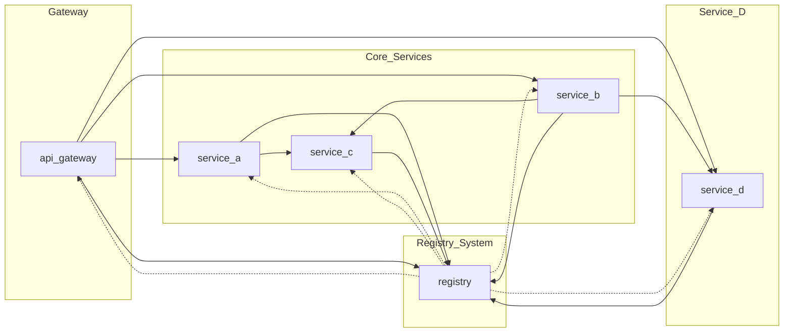

# LP-5.A
## Synchronous Microservices Architecture
### COMPSCI 426 – Scalable Web Systems

---
layout: default

## 🧭 Today's Goal

- Understand the architecture of the LP-5.A system
- Explore how synchronous microservices interact
- Get the system running locally
- Observe logging, request flow, and service behavior

---

## 📦 System Overview

- 6 microservices (5 Node.js, 1 Python)
- Communicate via HTTP (fetch)
- Use a registry for service discovery
- All services log using `pino` or Python `logging`
- Goal: build and observe a scalable, composable system

---

## 🗺️ System Diagram



---

## 🔧 Services and Responsibilities

### `api-gateway`
- Entry point for requests
- Forwards to A, B, or D
- Uses registry to discover service URLs

---

### `service-a`
- Forwards requests to `service-c`
- Combines response with metadata
- Uses registry for lookup

---

### `service-b`
- Calls `service-c`, then `service-d`
- Handles enriched response chain
- Uses registry for lookup

---

### `service-c` (FastAPI)
- Python-based
- Adds timestamp and metadata
- Registered with the system

---

### `service-d`
- Student-implemented
- Receives requests from `gateway` and `service-b`
- Logs to stdout and file
- Demonstrates latency, resilience, and integration

---

### `registry`
- In-memory discovery service
- Accepts `POST /register`
- Resolves `GET /lookup?name=...`

---

## 🔁 Registry Call Example

```ts
// service-a/index.ts
await fetch("http://localhost:3005/register", {
  method: "POST",
  headers: { "Content-Type": "application/json" },
  body: JSON.stringify({ name: "service-a", url: "http://localhost:3001" })
})
```

---

## 📡 Lookup Example

```ts
const res = await fetch("http://localhost:3005/lookup?name=service-c");
const { url } = await res.json();
```

---

## 🧪 What to Do Today

- Clone the repository or unzip the starter files
- Run: `npm install`
- Run: `npm run start:all`
- Run: `npm run start:c` (for service-c)
- Try: `npm run start:test`

---

## 🔍 Observe

- Logs in terminal and `logs/service-d.log`
- Calls flowing from gateway to A, B, D
- What happens if you kill `service-c`?
- What happens if the registry is down?

---

## 🚀 Coming Soon

Next step: implement `service-d`

- Add logging
- Forward requests
- Use service discovery
- Handle latency and failure

---

## 💬 Questions?
