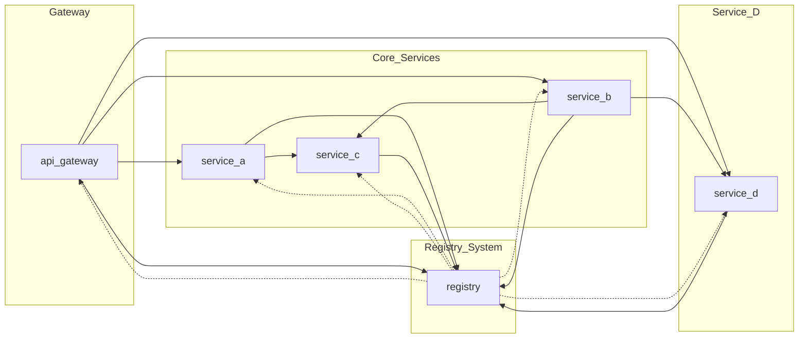

# 🧩 LP-5.A
## **A Synchronous Microservices System**
### COMPSCI 426 - Scalable Web Systems

---

# Synchronous Microservices Overview
### Class Exercise: Get the System Running & Observe Behavior

---

## 🧠 Learning Goals

- Understand synchronous microservice architecture
- Observe inter-service communication and dependencies
- Practice service discovery and logging
- Identify failure modes and latency

---

## 🧭 What You'll Do Today

✅ Clone starter code  
✅ Install dependencies  
✅ Run all services  
✅ Send requests using test scripts  
✅ Observe logging and call flow

---

## 📦 Services Overview

| Service       | Role                                         |
| ------------- | -------------------------------------------- |
| `api-gateway` | Entry point, routes to other services        |
| `service-a`   | Calls `service-c`                            |
| `service-b`   | Calls `service-c` and then `service-d`       |
| `service-c`   | Enriches data with metadata (Python/FastAPI) |
| `service-d`   | New service you implement                    |
| `registry`    | Service discovery for registration & lookup  |

---

## 🗺️ Architecture Diagram



---

## 🔁 Registry Communication Example

```ts
// register.ts
await fetch('http://localhost:3005/register', {
  method: 'POST',
  headers: { 'Content-Type': 'application/json' },
  body: JSON.stringify({ name: 'service-a', url: 'http://localhost:3001' })
});
```

---

## 📡 Looking Up a Service

```ts
const res = await fetch('http://localhost:3005/lookup?name=service-c');
const { url } = await res.json();
```

---

## 📥 API Gateway: Forwarding a Request

```ts
app.post('/a', async (req, res) => {
  const serviceUrl = await lookupService('service-a');
  const result = await fetch(serviceUrl, {
    method: 'POST',
    headers: { 'Content-Type': 'application/json' },
    body: JSON.stringify(req.body)
  });
  res.json(await result.json());
});
```

---

## 📤 Service A: Forwarding to Service C

```ts
app.post('/', async (req, res) => {
  const serviceCUrl = await lookupService('service-c');
  const response = await fetch(serviceCUrl, {
    method: 'POST',
    headers: { 'Content-Type': 'application/json' },
    body: JSON.stringify({ source: 'service-a', message: req.body.message })
  });
  res.json(await response.json());
});
```

---

## 🐍 Service C: Enriching the Message

```python
@app.post("/")
async def enrich(message: Message):
    return {
        "from": "service-c",
        "originalMessage": message.message,
        "timestamp": datetime.utcnow().isoformat()
    }
```

---

## 📦 Understanding `package.json`

Let’s take a look at the system’s root `package.json` and understand what each section does and why it matters.

---

## 🏷️ Basic Metadata

```json
{
  "name": "lp-5a-microservices",
  "version": "1.0.0",
  "description": "Lesson Practice 5.A: Synchronous Microservices System with Node.js and FastAPI",
  "type": "module",
```

- `name`, `version`, `description`: Metadata for the project
- `type: module`: Enables ES module syntax (`import`) in Node.js

---

## 🏁 Scripts Overview (Part 1)

```json
"scripts": {
  "start:gateway": "nodemon --watch api-gateway --exec tsx api-gateway/index.ts",
  "start:a": "nodemon --watch service-a --exec tsx service-a/index.ts",
  "start:b": "nodemon --watch service-b --exec tsx service-b/index.ts",
  "start:c": "npm --prefix service-c run serve",
```

- `start:*`: Each starts an individual service using live-reload
- `tsx` compiles and runs TypeScript files directly
- `start:c` runs a Python FastAPI service using a sub-package
- `nodemon`: a useful utility application that watches directories for changes and starts and restarts the application it is provided if there are any changes.

---

## 🏁 Scripts Overview (Part 2)

```json
  "start:d": "nodemon --watch service-d --exec tsx service-d/index.ts",
  "start:registry": "nodemon --watch registry --exec tsx registry/index.ts",
  "start:all": "concurrently -n gateway,a,b,c,d,registry -c blue,green,magenta,red,yellow,cyan ...",
  "start:test": "tsx requests.ts",
  "start:autocannon": "tsx autocannon.ts"
},
```

- `start:all`: Runs all services at once with color-coded logs
- `start:test`: Sends a few manual requests
- `start:autocannon`: Runs a load test using autocannon

---

## 🏁 `start:test` Example Output

`start:test` example output:

```bash
✅ /a (200) in 89ms
{
  "from": "service-a",
  "originalMessage": "hello from /a",
  "serviceCResponse": {
    "from": "service-c",
    "originalMessage": "hello from /a",
    "sourceService": "service-a",
    "timestamp": "2025-03-31T15:42:33Z"
  },
  "timestamp": "2025-03-31T15:42:33.167Z"
}
```

As you can see in the output, `service-a` contacts `service-c` to produce a response.

---

## 📚 Dependencies (Runtime)

```json
"dependencies": {
  "express": "^4.18.2",
  "pino": "^8.17.0",
  "pino-pretty": "^13.0.0"
}
```

- `express`: Web framework used by all Node services
- `pino`: Fast, structured JSON logger
- `pino-pretty`: Optional pretty-printing for console output

---

## 🧪 Dev Dependencies

```json
"devDependencies": {
  "@types/express": "^4.17.21",
  "@types/node": "^20.11.1",
  "autocannon": "^8.0.0",
  "concurrently": "^8.2.0",
  "nodemon": "^3.0.2",
  "tsx": "^4.19.3",
  "typescript": "^5.3.3"
}
```

- `@types/*`: Type definitions for Express and Node
- `autocannon`: HTTP benchmarking tool for load testing
- `concurrently`: Run multiple services/scripts in parallel
- `nodemon`: Restarts services automatically when code changes
- `tsx`: Lightweight TypeScript runner
- `typescript`: The compiler for `.ts` files

---

## ✅ Summary: Why This Matters

- Scripts make it easy to run and manage services
- Dependencies support fast development, logging, and testing
- Everything is designed to help you focus on behavior and system dynamics, not setup

Run this system like a pro — with `npm run start:all`. 🚀

Better yet - test it like a pro - with `npm run start:test`. ✅

---

## 📊 Try This

- Run `npm run start:all`
- Then: `npm run start:test`
- Then: `npm run start:autocannon`
- View `logs/service-d.log`
- Try killing a service and restarting it

---

## 🔍 What To Observe Today

- Does each service start up correctly?
- What happens if the registry is down?
  - You will need to run the services individually to kill the registry
- What gets logged to the console when you send a request?
- Which services log their results to the `logs/` directory?
  - Why are the other services not logging to a file? 
- What’s the shape of the response (i.e., what does the JSON look like)?
- What are the results from running the `requests.ts` test script?
- What are the results from running the `autocannon.ts` test script?
  - How does latency behave with `autocannon`?

**There is no coding in today's exercise!**

**But, you still need to submit answers to these questions.**

---

## 🧠 Discussion

- What assumptions does this architecture make?
- What are failure points?
- How would you add observability?
- How do you scale parts of this system?

---

## 🚀 Summary

- You now have a working multi-service system
- You’ve seen service discovery and call chaining
- Logging, latency, and registry behavior are observable
- **Next Class:** You’ll extend `service-d` to flesh out the pipeline

---

## 💬 Questions?

Any questions?