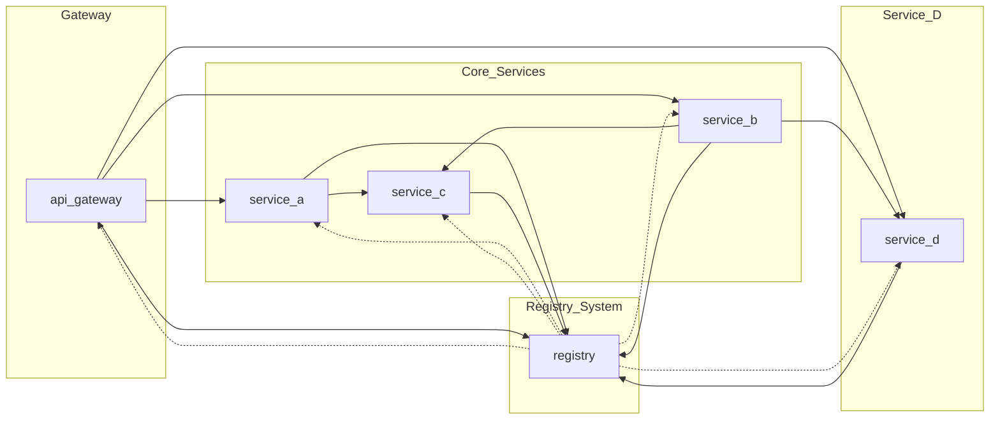
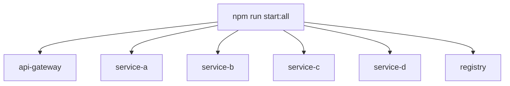

# 🧩 LP-5.A Microservices System
## Overview & Development Environment

Tim Richards  
COMPSCI 426 — Scalable Web Systems

---

# 🚦 Today's Exercise

### Goal
> ✅ **Start the system and observe its behavior**.

### Steps
- Run all services using `npm run start:all`
- Use `npm run start:test` to send example requests
- Watch the logs and how services respond

---

# 🧠 Architecture Overview



---

# 🧱 Services and Responsibilities

## api-gateway
- Entry point to the system
- Routes requests to `/a`, `/b`, `/d`
- Uses registry for service discovery

---

## service-a
- Receives request from gateway
- Forwards to `service-c`
- Combines response and returns

---

## service-b
- Receives request from gateway
- Forwards to `service-c` and then `service-d`
- Combines both responses and returns

---

## service-c (FastAPI)
- Receives data
- Appends timestamp and metadata
- Returns result — no outbound calls

---

## service-d (You Build)
- Accepts requests from `/d` and `/from-b`
- Logs to stdout and file
- Talks to registry and other services

---

## registry
- Keeps track of services and their URLs
- Services register on startup
- Other services look up names during execution

---

# 💾 package.json: Overview

```json {2-4}
{
  "name": "lp-5a-microservices",
  "version": "1.0.0",
  "description": "...",
  "type": "module",
  ...
}
```

---

## 🎛️ Scripts Section

```json {2-7}
"scripts": {
  "start:gateway": "...",
  "start:a": "...",
  "start:b": "...",
  "start:c": "...",
  "start:d": "...",
  "start:registry": "...",
  "start:all": "..."
}
```

Each service has its own script.  
You can run everything with `npm run start:all`.

---

# 📦 Visualizing Service Scripts



---

# 📜 What `start:all` Does

```bash
npm run start:all
```

- Uses `concurrently` to launch:
  - 5 Node services via `tsx + nodemon`
  - 1 Python service via `npm --prefix`

---

## 🧪 Testing Scripts

```json
"start:test": "tsx requests.ts",
"start:autocannon": "tsx autocannon.ts"
```

- `start:test`: Sends sample requests through gateway
- `start:autocannon`: Benchmarks performance

---

# 📦 Dependencies (Runtime)

| Package         | Purpose                      |
|-----------------|------------------------------|
| `express`       | HTTP web server              |
| `pino`          | Fast structured logger       |
| `pino-pretty`   | Dev-mode log formatting      |

---

# 🛠️ DevDependencies

| Package           | Role                                  |
|-------------------|---------------------------------------|
| `nodemon`         | Restart on file changes               |
| `tsx`             | Run TypeScript without compiling      |
| `typescript`      | Type-safe JavaScript                  |
| `@types/*`        | TypeScript definitions                |
| `concurrently`    | Run multiple npm scripts at once      |
| `autocannon`      | Load testing tool                     |

---

# 🧠 In-Class Activity

### Start the system

```bash
npm run start:all
```

### Then test it

```bash
npm run start:test
```

---

## 🔍 Things to Observe

- What logs do you see?
- What happens if you kill `service-c`?
- Can you trace a call from gateway → a → c?
- What’s logged in `logs/service-d.log`?

---

# 🧪 Optional Exploration

- Inject latency using `setTimeout()`
- Add trace ID propagation to all requests
- Log metrics in memory every 30 seconds

---

# 💬 Questions?
## Try starting each service individually and testing routes