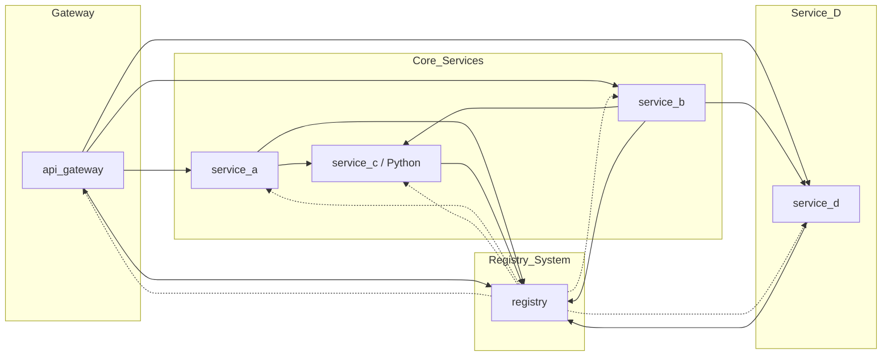
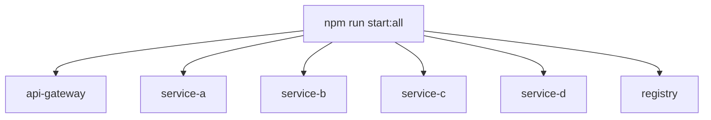

# 🧩 LP-5.A Microservices System

## Overview & Development Environment

Tim Richards  
COMPSCI 426 — Scalable Web Systems

---

# 🧠 Learning Goals

- Understand synchronous microservice architecture
- Observe inter-service communication and dependencies
- Practice service discovery and logging
- Identify failure modes and latency

---

# 🚦 Today's Exercise

## Goal

>
> ✅ **Start the system and observe its behavior**.
>
<br>

## Steps

- Download and setup the system
- Run all services using `npm run start:all`
- Use `npm run start:test` to send example requests
- Watch the logs and how services respond

---

# 📦 Services Overview

| Service       | Role                                         |
| ------------- | -------------------------------------------- |
| `api-gateway` | Entry point, routes to other services        |
| `service-a`   | Calls `service-c`                            |
| `service-b`   | Calls `service-c` and then `service-d`       |
| `service-c`   | Enriches data with metadata (Python/FastAPI) |
| `service-d`   | New service you implement                    |
| `registry`    | Service discovery for registration & lookup  |

---

# 🧠 Architecture Overview



---

# 🧱 Services and Responsibilities

## registry

- Keeps track of services and their URLs
- Services register on startup
- Other services look up names during execution

## 🔁 Registry Communication Example

```ts
// register.ts
await fetch('http://localhost:3005/register', {
  method: 'POST',
  headers: { 'Content-Type': 'application/json' },
  body: JSON.stringify({ name: 'service-a', url: 'http://localhost:3001' })
});
```

---

# 📡 Looking Up a Service

## Service Lookup

```ts
const res = await fetch('http://localhost:3005/lookup?name=service-c');
const { url } = await res.json();
```
<br>

## Registry Route

```ts
app.get('/lookup', (req, res) => {
  const name = req.query.name as string;

  if (!name) {
    return res.status(400).json({ error: 'Missing service name' });
  }

  const url = services[name];
  if (!url) {
    return res.status(404).json({ error: 'Service not found' });
  }

  res.json({ url });
});
```

---

# 📥 API Gateway

- Entry point to the system
- Routes requests to `/a`, `/b`, `/d`
- Uses registry for service discovery
<br>

## Forwarding a Request

```ts
app.post('/a', async (req, res) => {
  const serviceUrl = await lookupService('service-a');
  const result = await fetch(serviceUrl, {
    method: 'POST',
    headers: { 'Content-Type': 'application/json' },
    body: JSON.stringify(req.body)
  });
  res.json(await result.json());
});
```

---

## 📤 Service A

- Receives request from gateway
- Forwards to `service-c`
- Combines response and returns
<br>

## Service A Forwarding to Service C

```ts
app.post('/', async (req, res) => {
  const serviceCUrl = await lookupService('service-c');
  const response = await fetch(serviceCUrl, {
    method: 'POST',
    headers: { 'Content-Type': 'application/json' },
    body: JSON.stringify({ source: 'service-a', message: req.body.message })
  });
  res.json(await response.json());
});
```

---

## Service B

- Receives request from gateway
- Forwards to `service-c` and then `service-d`
- Combines both responses and returns

---

# 🐍 Service C (FastAPI)

- Receives data
- Appends timestamp and metadata
- Returns result — no outbound calls
<br>

## Enriching the Message

```python
@app.post("/")
async def enrich(message: Message):
    return {
        "from": "service-c",
        "originalMessage": message.message,
        "timestamp": datetime.utcnow().isoformat()
    }
```

---

## Service D (You Build Next Time)

- Accepts requests from `/d` and `/from-b`
- Logs to stdout and file
- Talks to registry and other services

---

# 💾 package.json: Overview

```json {2-4}
{
  "name": "lp-5a-microservices",
  "version": "1.0.0",
  "description": "...",
  "type": "module",
  ...
}
```

---

## 🎛️ Scripts Section

```json {2-7}
"scripts": {
  "start:gateway": "...",
  "start:a": "...",
  "start:b": "...",
  "start:c": "...",
  "start:d": "...",
  "start:registry": "...",
  "start:all": "..."
}
```

Each service has its own script.  
You can run everything with `npm run start:all`.

---

# 📦 Visualizing Service Scripts



---

# 📜 What `start:all` Does

```bash
npm run start:all
```

- Uses `concurrently` to launch:
  - 5 Node services via `tsx + nodemon`
  - 1 Python service via `npm --prefix`

---

# 🧪 Testing Scripts

```json
"start:test": "tsx requests.ts",
"start:autocannon": "tsx autocannon.ts"
```

- `start:test`: Sends sample requests through gateway
- `start:autocannon`: Benchmarks performance

---

# 🏁 `npm run start:test` Example Output

```bash
✅ /a (200) in 89ms
{
  "from": "service-a",
  "originalMessage": "hello from /a",
  "serviceCResponse": {
    "from": "service-c",
    "originalMessage": "hello from /a",
    "sourceService": "service-a",
    "timestamp": "2025-03-31T15:42:33Z"
  },
  "timestamp": "2025-03-31T15:42:33.167Z"
}
```

As you can see in the output, `service-a` contacts `service-c` to produce a response.

---

# 📦 Dependencies (Runtime)

| Package       | Purpose                 |
| ------------- | ----------------------- |
| `express`     | HTTP web server         |
| `pino`        | Fast structured logger  |
| `pino-pretty` | Dev-mode log formatting |

---

# 🛠️ DevDependencies

| Package        | Role                             |
| -------------- | -------------------------------- |
| `nodemon`      | Restart on file changes          |
| `tsx`          | Run TypeScript without compiling |
| `typescript`   | Type-safe JavaScript             |
| `@types/*`     | TypeScript definitions           |
| `concurrently` | Run multiple npm scripts at once |
| `autocannon`   | Load testing tool                |

---

# ✅ Summary: Why This Matters

- Scripts make it easy to run and manage services
- Dependencies support fast development, logging, and testing
- Everything is designed to help you focus on behavior and system dynamics, not setup

Run this system like a pro — with `npm run start:all`. 🚀

Better yet - test it like a pro - with `npm run start:test`. ✅

---

# 🧠 Today's Lesson Practice Activity

The purpose of today's activity is to simply explore the provided `lp-5.a` *synchronous* microservice system to understand its architecture, how to run it, how communication works, and how to test it.

- You are required to download the code
- Set things up
- Run tests
- Discuss in your group (if you are in a group)
- Report observations

**There is no coding today**

---

# 🧠 Today's Lesson Practice Activity

Starting and testing the system.

## Start the system

```bash
npm run start:all
```

## Then test it

```bash
npm run start:test
npm run start:autocannon
```

---
layout: two-cols 
---

# 🔍 Questions?

What questions can we ask?

- Does each service start up correctly?
- What happens if the registry is down?
  - You will need to run the services individually to kill the registry
- What logs do you see?
- What happens if you kill `service-c`?
- Can you trace a call from gateway → a → c?
- What gets logged to the console when you send a request?

::right::

# 🔍 Observations?

What observations can we make?

- Which services log their results to the `logs/` directory?
  - Why are the other services not logging to a file?
- What’s the shape of the response (i.e., what does the JSON look like)?
- What are the results from running the `requests.ts` test script?
- What are the results from running the `autocannon.ts` test script?
  - How does latency behave with `autocannon`?

---

# 🧠 Start Activity

You have now until {{ minutes }} minutes before the end of class to complete the activity.

## ⏳ {{ minutes }}-Minute Timer

<div style="margin-bottom: 1rem;">
  <label style="font-size: 1.2rem; margin-right: 1rem;">Select Duration:</label>
  <button @click="setDuration(5)">5 min</button> |
  <button @click="setDuration(10)">10 min</button> |
  <button @click="setDuration(15)">15 min</button> |  
  <button @click="setDuration(20)">20 min</button> 
</div>

<div style="font-size: 4rem; margin: 1rem 0;">
  {{ minutes }}:{{ secondsPadded }}
</div>

<div
  style="height: 20px; width: 80%; background: #ddd; border-radius: 10px; overflow: hidden; margin-bottom: 1rem;"
>
  <div
    :style="{
      height: '100%',
      width: barWidth + '%',
      background: timeLeft > 0 ? '#4caf50' : '#e53935',
      transition: 'width 1s linear'
    }"
  ></div>
</div>

<div v-if="timeLeft <= 0" style="font-size: 2rem; color: #e53935; font-weight: bold;">
  🛎️ Time's up!
</div>

<button @click="startTimer" style="margin-top: 1rem;">🏁 Start</button><br>
<button @click="stop" style="margin-top: 1rem;">🛑 Stop</button><br>
<button @click="restart" style="margin-top: 1rem;">🔁 Restart</button>

<script setup>
import { ref, computed, onMounted, watch } from 'vue'

const defaultDuration = 20 * 60
const totalTime = ref(defaultDuration)
const timeLeft = ref(defaultDuration)
let intervalId = null

const minutes = computed(() => Math.floor(timeLeft.value / 60))
const seconds = computed(() => timeLeft.value % 60)
const secondsPadded = computed(() => String(seconds.value).padStart(2, '0'))
const barWidth = computed(() => (timeLeft.value / totalTime.value) * 100)

function tick() {
  if (timeLeft.value > 0) {
    timeLeft.value--
  } else {
    clearInterval(intervalId)
    intervalId = null
  }
}

function startTimer() {
  clearInterval(intervalId)
  intervalId = setInterval(tick, 1000)
}

function setDuration(minutes) {
  totalTime.value = minutes * 60
  timeLeft.value = totalTime.value  
}

function restart() {
  timeLeft.value = totalTime.value
}

function stop() {
  clearInterval(intervalId)
  intervalId = null
}

onMounted(() => {
  
})
</script>

---
hide: true
---

# 🧪 Optional Exploration

- Inject latency using `setTimeout()`
- Add trace ID propagation to all requests
- Log metrics in memory every 30 seconds

---

# 🧠 Discussion

- What assumptions does this architecture make?
- What are failure points?
- How would you add observability?
- How do you scale parts of this system?

---

# 🚀 Summary

- You now have a working multi-service system
- You’ve seen service discovery and call chaining
- Logging, latency, and registry behavior are observable
- **Next Class:** You’ll extend `service-d` to flesh out the pipeline

---

# 💬 Questions?

Any questions?
