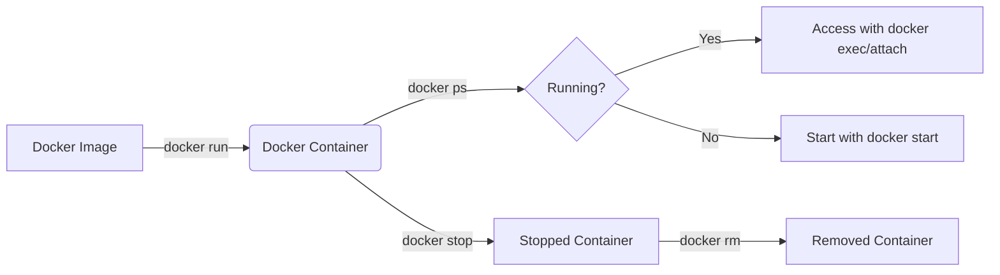
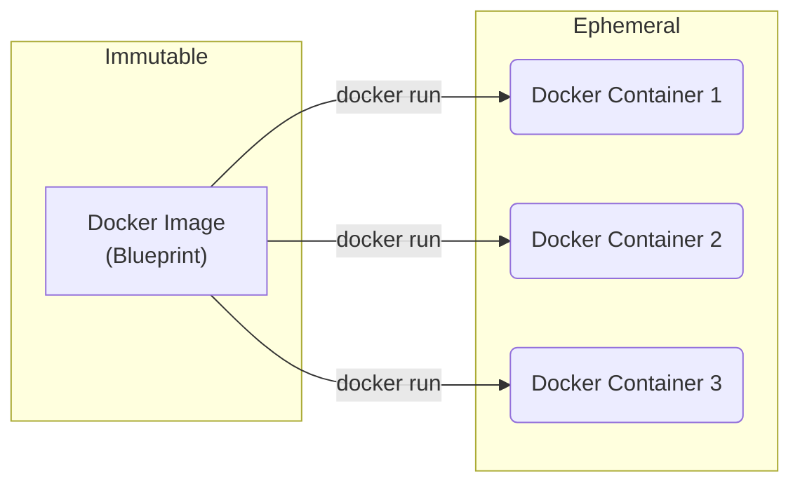

---
# You can also start simply with 'default'
theme: default
favicon: favicon.ico
# random image from a curated Unsplash collection by Anthony
# like them? see https://unsplash.com/collections/94734566/slidev
background: https://cover.sli.dev
# some information about your slides (markdown enabled)
title: Lecture 16 Docker Commands, Containers, and Images
info: |
# apply unocss classes to the current slide
class: text-center
# https://sli.dev/features/drawing
drawings:
  persist: false
# slide transition: https://sli.dev/guide/animations.html#slide-transitions
transition: slide-left
# enable MDC Syntax: https://sli.dev/features/mdc
mdc: true
# open graph
# seoMeta:
#  ogImage: https://cover.sli.dev
---

# Scalable Web Systems

Lecture 16

Docker Commands, Containers, and Images

---

# Agenda

1. Review of Basic Docker Container Commands
2. Review of Basic Docker Image Commands
3. Running Containers: Interactive vs Detached Modes
4. Accessing Running Containers
5. Diagrams + Summary

---

# Basic Docker Container Commands

We have investigated several examples of using Docker at this point. Let go over
some of these commands and provide a little more detail and some examples.

We'll review the following:

- `docker run`
- `docker ps`
- `docker stop`
- `docker rm`

---

## `docker run`

**Format:**

```bash
docker run [OPTIONS] IMAGE [COMMAND] [ARG...]
```

**Example:**

```bash
docker run hello-world
```

**Description:**
Creates and starts a new container from the given image. Running this command
will print the ID of the container to the terminal:

```bash
❯ docker run -d --name web-front -p 8080:80 nginx
9e23ab966dd3bd8456d949329398975ead2cb5cb3bbae250b08acf036ab0d445
```

The container ID is important for other commands to designate actions to be
performed on specific containers.

**Use Case:**
Run an image like `hello-world` to verify that Docker is installed correctly.

---

## `docker ps`

**Format:**

```bash
docker ps [OPTIONS]
```

**Example:**

```bash
❯ docker ps -a
CONTAINER ID   IMAGE         COMMAND                  CREATED              STATUS                          PORTS                          NAMES
a21476a4486f   nginx         "/docker-entrypoint.…"   3 seconds ago        Up 2 seconds                    80/tcp, 0.0.0.0:8081->81/tcp   web-front2
94a68639c63a   hello-world   "/hello"                 About a minute ago   Exited (0) About a minute ago                                  awesome_cerf
9e23ab966dd3   nginx         "/docker-entrypoint.…"   6 minutes ago        Up 6 minutes                    0.0.0.0:8080->80/tcp           web-front
```

As you can see above, there are three different containers shown in the output
above. Two of them are running and the other has exited. But, the container
that exited still exists. We need to use another command to clean up if we
want to do that.

**Description:**
Lists running containers. Use `-a` to show all containers including stopped ones.

**Use Case:**
See which containers are currently running or have recently run.

---

## `docker logs`

**Format:**

```bash
docker logs [OPTIONS] CONTAINER
```

**Example:**

Dumps logs to standard output:
```bash
docker logs web-front
```

Follow the container’s logs in real-time (like tail -f), great for live
debugging or development:
```bash
docker logs -f web-front
```

**Description:**
Fetches and displays the stdout/stderr logs from a container. Use options like 
`--tail` and `-f` to control output.

**Use Case:**
Debug a containerized application by viewing its output, errors, and status 
messages.

---

## `docker stop`

**Format:**

```bash
docker stop CONTAINER [CONTAINER...]
```

**Example:**

```bash
docker stop my_container
```

**Description:**
Gracefully stops a running container.

**Use Case:**
Stop a container before deleting or restarting it.

---

## `docker rm`

**Format:**

```bash
docker rm [OPTIONS] CONTAINER [CONTAINER...]
```

**Example:**

```bash
docker rm my_container
```

**Description:**
Removes one or more containers.

**Use Case:**
Clean up containers you no longer need.

---

# Example: NGINX Web Server

## 🔥 Step 1: Run a Scalable Web Server

<br>
```bash
docker run -d --name web-front -p 8080:80 nginx
```

**What it does:**
- Runs `nginx` in **detached** mode (`-d`)
- Names the container `web-front`
- Maps your local port 8080 to container port 80

🧠 **Use Case:** 
Start a reverse proxy or web front-end in a microservices setup.

---

## 🔍 Step 2: Check Running Containers

<br>
```bash
docker ps
```

**What you'll see:**
- Container `web-front`
- Status: Up
- Port: 0.0.0.0:8080 → 80/tcp

🧠 **Use Case:** 
Confirm it’s running and check ports/status.

---

## 🛑 Step 3: Stop the Container

<br>
```bash
docker stop web-front
```

**What it does:**
- Gracefully stops the nginx container

🧠 **Use Case:** 
Temporarily shut down the service without losing data (unless it's ephemeral).

---

## 🧹 Step 4: Remove the Container

<br>
```bash
docker rm web-front
```

**What it does:**
- Deletes the stopped container from your system

🧠 **Use Case:** 
Clean up resources after testing or deployment.

---

# Running Containers

## Interactive vs Detached Mode

---

## `-it` (Interactive Mode)

**Format:**

```bash
docker run -it IMAGE [COMMAND]
```

**Example:**

```bash
docker run -it ubuntu /bin/bash
```

**Description:**
Runs a container with interactive terminal support.

**Use Case:**
Useful for debugging, trying out commands inside the container.

---

## `-d` (Detached Mode)

**Format:**

```bash
docker run -d IMAGE [COMMAND]
```

**Example:**

```bash
docker run -d nginx
```

**Description:**
Runs a container in the background.

**Use Case:**
Start a long-running service like a web server.

---

# Accessing Running Containers

---

## `docker exec`

**Format:**

```bash
docker exec [OPTIONS] CONTAINER COMMAND [ARG...]
```

**Example:**

```bash
docker exec -it my_container bash
```

**Description:**
Run a command inside a running container.

**Use Case:**
Get a shell inside a running container.

---

## `docker attach`

**Format:**

```bash
docker attach [OPTIONS] CONTAINER
```

**Example:**

```bash
docker attach my_container
```

**Description:**
Attach your terminal to a running container's process.

**Use Case:**
Useful for re-attaching to a container started in `-it` mode.

---

# Docker Diagram



---

# Basic Docker Image Commands

Today, we are going to turn our attention towards images as they are the blueprint
from which *containers* are created. Before looking at how to build our own images, 
we are going to look at what we can do with the images we already have.

Here are a few commands to get us started:

- `docker images`
- `docker pull`
- `docker rmi`

---

## `docker images`

**Format:**

```bash
docker images [OPTIONS] [REPOSITORY[:TAG]]
```

**Example:**

```bash
docker images
```

**Description:**
Lists local images.

**Use Case:**
See which images are available locally on your machine.

---

## `docker pull`

**Format:**

```bash
docker pull [OPTIONS] NAME[:TAG|@DIGEST]
```

**Example:**

```bash
docker pull ubuntu:20.04
```

**Description:**
Downloads an image from a Docker registry (e.g., Docker Hub).

**Use Case:**
Ensure you have the latest version of a base image like Ubuntu.

---

## `docker rmi`

**Format:**

```bash
docker rmi [OPTIONS] IMAGE [IMAGE...]
```

**Example:**

```bash
docker rmi ubuntu:20.04
```

**Description:**
Deletes one or more images from the local machine.

**Use Case:**
Clean up disk space by removing unused images.

---

# Additional Useful Container Commands

---

## `docker start`

**Format:**

```bash
docker start CONTAINER
```

**Example:**

```bash
docker start my_container
```

**Description:**
Starts a stopped container.

**Use Case:**
Resume a container without needing to recreate it.

---

## `docker restart`

**Format:**

```bash
docker restart CONTAINER
```

**Example:**

```bash
docker restart my_container
```

**Description:**
Stops and then starts a container.

**Use Case:**
Apply changes or refresh a misbehaving container.

---

## `docker logs`

**Format:**

```bash
docker logs [OPTIONS] CONTAINER
```

**Example:**

```bash
docker logs my_container
```

**Description:**
Fetches logs from a container's stdout and stderr.

**Use Case:**
Debug container behavior or output.

---

## `docker top`

**Format:**

```bash
docker top CONTAINER
```

**Example:**

```bash
docker top my_container
```

**Description:**
Displays running processes inside a container.

**Use Case:**
Diagnose hanging or busy containers.

---

## `docker inspect`

**Format:**

```bash
docker inspect [OPTIONS] NAME|ID [NAME|ID...]
```

**Example:**

```bash
docker inspect my_container
```

**Description:**
Displays detailed JSON information about containers.

**Use Case:**
Inspect port mappings, volume mounts, or container IP addresses.

---

## `docker stats`

**Format:**

```bash
docker stats [OPTIONS] [CONTAINER...]
```

**Example:**

```bash
docker stats
```

**Description:**
Displays a live stream of container resource usage statistics.

**Use Case:**
Monitor performance for running containers.

---

# Docker Images vs Containers

<div style="font-size: 0.9em">

| Feature         | Docker **Image**                        | Docker **Container**                                                |
| --------------- | --------------------------------------- | ------------------------------------------------------------------- |
| **Definition**  | A snapshot or blueprint of a filesystem | A running (or stopped) instance of an image                         |
| **State**       | Static                                  | Dynamic (can run, stop, restart, etc.)                              |
| **Persistence** | Immutable                               | Ephemeral by default, changes not saved unless committed or mounted |
| **Storage**     | Stored on disk, layered                 | Lives in memory while running (plus volume mounts)                  |
| **Use Case**    | Shared, reused across many containers   | Executes the application or service                                 |
| **Analogy**     | Like a **class** in programming         | Like an **object** created from the class                           |

</div>

---
layout: two-cols
---

# Docker Image vs Containers



::right::
<div style="margin-left: 40px">

**Immutable:**

> **Definition:** Cannot be changed after it's created.

- Docker **images** are immutable.
- Once built, the image content (files, layers) does not change.
- Promotes consistency: same image runs the same way anywhere.

**Ephemeral:**

> **Definition:** Temporary; short-lived by default.

- Docker **containers** are ephemeral.
- Any changes made inside a container (without volumes) are lost when it stops.
- Containers are meant to be disposable and reproducible.
</div>
