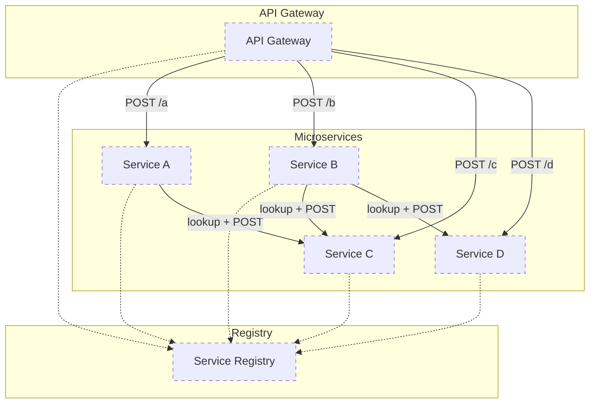
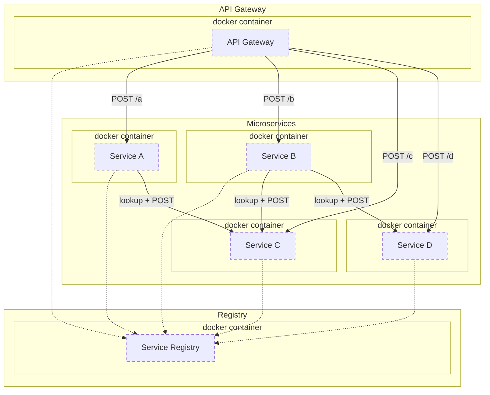
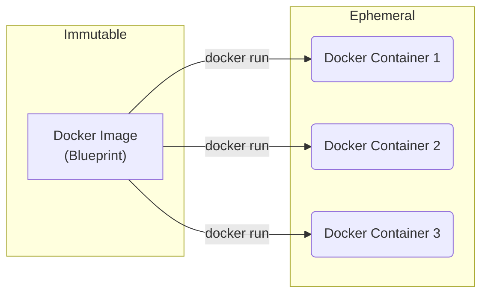
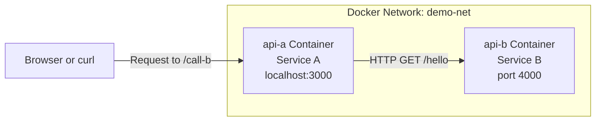

---
# You can also start simply with 'default'
theme: default
favicon: favicon.ico
# random image from a curated Unsplash collection by Anthony
# like them? see https://unsplash.com/collections/94734566/slidev
background: https://cover.sli.dev
# some information about your slides (markdown enabled)
title: Lecture 16 Docker Images
info: |
# apply unocss classes to the current slide
class: text-center
# https://sli.dev/features/drawing
drawings:
  persist: false
# slide transition: https://sli.dev/guide/animations.html#slide-transitions
transition: fade
# enable MDC Syntax: https://sli.dev/features/mdc
mdc: true
# open graph
# seoMeta:
#  ogImage: https://cover.sli.dev
---

# Scalable Web Systems

Lecture 16

Docker Images

---

# Agenda

1. use the microservices model example from before (service a, b, c, d)
2. create a Dockerfile for each
3. create a Network for each
4. build an image for each
5. run each service
6. add a simple front-end with Docker (back-end for front-end)
7. expose port and have it communicate with gateway

---
layout: two-cols-header
---

# Microservice Architecture

Remember this architecture we <br>
investigated previously?

::left::

<div style="margin: 10px 150px 10px -10px">

- **API Gateway**: Central entry point for all requests.
- **Service Registry**: Keeps track of running services.
- **Microservices**: Individual services (A, B, C, D).

</div>

::right::

<div style="margin: -30px -50px 0px -40px">


</div>

---
layout: two-cols-header
---

# Microservice Architecture

Remember this architecture we <br>
investigated previously?

::left::

<div style="margin: 10px 150px 10px -10px">

Microservices are a good way to help application scale. However,
the deployment of such applications must also scale.

We can use Docker to *containerize* each service into a separately
running container. This will allow us to easily deploy and scale
parts of the application independently.

It will also allow us to easily "wire up" our services to make it
easier to develop and introduce new services.

</div>

::right::

<div style="margin: -30px -50px 0px -40px">


</div>

---
zoom: 1.6
---

# Containers vs Images

- At this point we have explored Docker by running containers from existing
images. Just this alone demonstrates how useful Docker is from a standpoint
of running complex applications without installing them.

- But, we want to do more than that. We want to be able to create images for
our own applications and run them in containers.

---
layout: two-cols-header
---

# Containers vs Images

**Images** are **blueprints**,<br>**containers** are **instances**.

::left::
<div style="margin: -20px 100px 0px 0px">

## Key Points
<div style="margin-bottom: 10px;"></div>

1. Images are **immutable**, <br>containers are **ephemeral**.
2. Changes to containers <br>**don't affect images**.
3. Multiple containers <br>**can run from the same image**.

</div>

::right::

<div style="margin: -80px -40px 0px -80px">



</div>

---
layout: two-cols-header
---

# Docker Images

How do you create a Docker image?

::left::

<div style="margin-top: -140px; margin-right: 20px;">

You create a Docker image by writing a **Dockerfile**, a text file that defines:

- The **base image** to start from (e.g., `node`, `python`, `alpine`)
- The **commands to run** (e.g., install packages, copy files)
- The **default behavior** when the container starts

</div>

::right::

<div style="margin-top: -130px; margin-left: 20px;">

Then, you build the image using:

```bash
docker build -t my-image-name .
```

*This packages everything into a reusable, shareable image — the foundation for running scalable services.*

</div>

---
zoom: 1.5
---

# Docker Images

What are the different parts of the `docker-build` command?

````md magic-move
```bash
docker build -t my-image-name .
```
```bash
docker build
# `docker build` tells Docker to build an image
```
```bash
docker build -t my-image-name
# `-t my-image-name` tags the image with a name 
# so you can reference it easily
```
```bash
docker build -t my-image-name .
# `.` (dot) specifies the "build context". This
# is usually the directory containing you Dockerfile
# and application source code
```
````

---
zoom: 1
---

# Simple Express Server

```bash
> ls -1
Dockerfile
index.ts
package.json
package-lock.json
tsconfig.json
```

---
zoom: 1
---

# Simple Express Server

<<< @/06-lecture-02-code/01-dockerized/index.ts

---
zoom: 1
---

# Package Configuration

<<< @/06-lecture-02-code/01-dockerized/package.json

---
zoom: 1
---

# TypeScript Configuration

<<< @/06-lecture-02-code/01-dockerized/tsconfig.json

---
zoom: 1.07
---
# What is a Dockerfile?

An overview of a basic Dockerfile.

```dockerfile {all|1,2|4,5|7,8|10,11|13,14|16,17|19,20|all}{lines: true}
# 1. Base image
FROM node:20-alpine

# 2. Set working directory
WORKDIR /app

# 3. Copy dependency files
COPY package*.json ./

# 4. Install dependencies
RUN npm install

# 5. Copy source code
COPY . .

# 6. Build TypeScript
RUN npm run build

# 7. Set default command
CMD ["node", "index.js"]
```

---
zoom: 1
---

# Back to the Expression application...

<<< @/06-lecture-02-code/01-dockerized/Dockerfile dockerfile

---
zoom: 1
---

# 🧪 Build + Run

```bash
docker build -t express-dev-tsx .
docker run -it -p 3000:3000 express-dev-tsx
```
<br>
<hr>

To enable **live reload from host changes**, mount the project directory:

**MacOS/Linux:**

```bash
docker run -it -p 3000:3000 -v $(pwd):/app express-dev-tsx
```

**Windows PowerShell:**

```powershell
docker run -it -p 3000:3000 -v ${PWD}:/app express-dev-tsx
```

**Windows cmd.exe:**

```cmd
docker run -it -p 3000:3000 -v %cd%:/app express-dev-tsx
```

---
zoom: 1.5
---

# Two Services

- The next interesting thing we want to do is to figure out
how to have two services talk to one another.
- If we can do that, then we can start building a microservice
architecture like the one we saw at the beginning.

---
zoom: 1.2
---

# 🛰️ Express Services Over Docker Network



This is the architecture we are going to build.

---
zoom: 1.2
---

# Service B

<<< @/06-lecture-02-code/02-two-services/service-b/index.ts

---
zoom: 1.2
---

# Service A

<<< @/06-lecture-02-code/02-two-services/service-a/index.ts

---
zoom: 1.2
---

# Dockerfiles

<<< @/06-lecture-02-code/02-two-services/service-a/Dockerfile dockerfile

Same for both service A and B

---
zoom: 1.1
---

# Package Configuration

<<< @/06-lecture-02-code/02-two-services/service-a/package.json

Same for both service A and B

---

# 🧪 Build + Run

Now it is time to build the services

Create a network:

```bash
docker network create demo-net
```

Visit the service directories in two terminals:

```bash
cd service-b # terminal 1
cd service-a # terminal 2
```

Run the following in terminal 1:

```bash
docker build -t service-b .
docker run -d --name api-b --network demo-net service-b
```

Run the following in terminal 2:

```bash
docker build -t service-a .
docker run -d --name api-a --network demo-net -p 3000:3000 service-a
```

---
zoom: 1.5
---

# Next Time

Bringing it all together!

---
hide: true
---

# Back to The Microservice Architecture

Dockerizing an entire system

We need to "dockerize" the following services:

- registry
- api-gateway
- service-a
- service-b
- service-c
- service-d

**This means:**
- They all need a `Dockerfile`
- They all need to be on the same network


